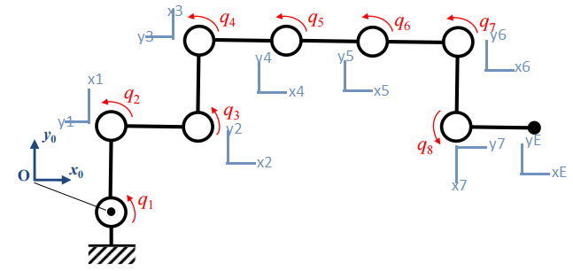
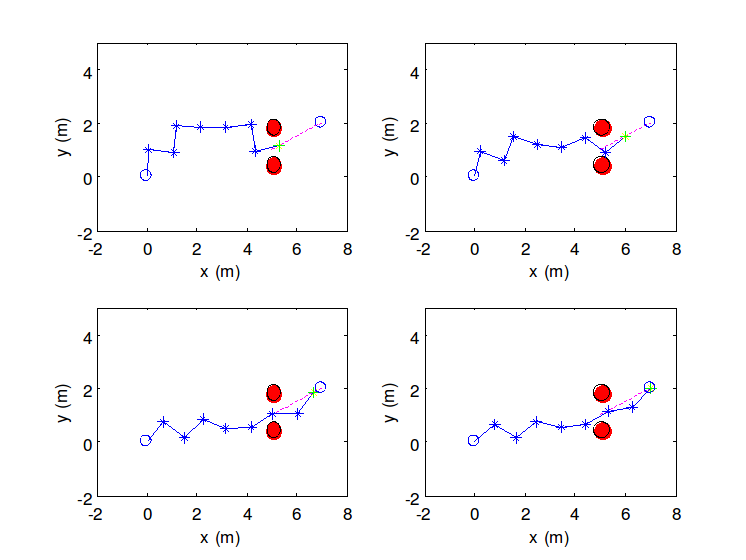

# Robotic Arm Controller With Redundant Degrees of Freedom

## Requirements
* numpy
* matplotlib

Tested with Python3.5.

## Goal
Drive a robotic arm towards a goal avoiding any obstacles.

## Arm
The examined configuration with Denavit-Hartenberg method axes denoted:

## Solution
We solve two separate subtasks: One forcing the effector to move along the desired trajectory and another one forcing minimum distance from an obstacle to be greater than a given safety distance.

## Run
Run main.py. This will trigger simulation and create the gifs seen in https://nickgkan.github.io/

### Intermediate Steps Example

